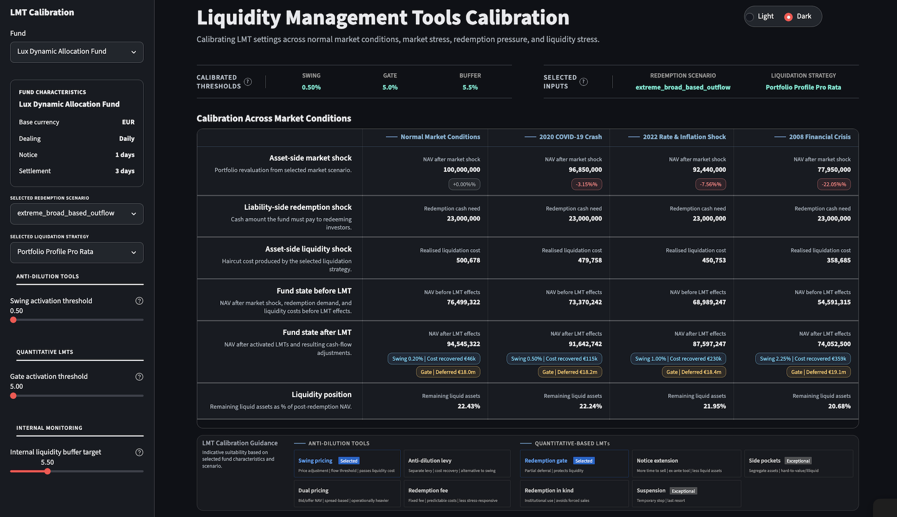

# Liquidity Management Tools Calibration


[](https://www.esma.europa.eu/document/guidelines-liquidity-management-tools-ucits-and-open-ended-aifs)
[](https://www.cssf.lu/wp-content/uploads/cssf26_910eng.pdf)


This project is an LMT calibration tool. It provides an interactive dashboard to configure redemption, market, and liquidity stress scenarios alongside selected liquidity management actions, including liquidation strategy, threshold calibration, activation timing, and tool selection, to support informed LMT threshold calibration.

The dashboard provides three complementary analyses:
* **Market scenarios & notice-period liquidity** - can the fund meet redemptions within the configured notice and settlement horizon under different market conditions?
* **12-month redemption path** - how do manager-selected LMT application timings affect paid redemptions, deferrals, shortfall, backlog, and NAV over successive monthly periods?
* **Time to liquidation** - how many business days are needed to raise cash for benchmark redemption shocks under participation-rate and liquidity-haircut sensitivities?

<br>


<p align="center"><em>The screenshots use a synthetic example fund. The underlying data can be replaced with other fund datasets through the documented input structure.</em></p>


The current application handles a broad range of portfolio exposures, including repos, bonds, listed equities, listed ETFs, and selected derivatives, to model market and liquidity stress. It also supports investor bases with different client classes and redemption behaviours, which are used in multi-period redemption stress modelling.


The scenarios used for calibration combine:

* **Liability-side multi-period pressure** from investor redemptions, supporting a mix of client classes with different redemption behaviours.
* **Asset-side pressure** from market shocks, liquidity haircuts, and realised liquidation costs, supporting a broad range of portfolio exposures, including repos, bonds, listed equities, listed ETFs, and selected derivatives.


---

## Regulatory context

This project uses the liquidity-management framework for UCITS and open-ended AIFs as regulatory context, including ESMA Guidelines on Liquidity Management Tools, related EU delegated regulations, and Luxembourg CSSF Circular 26/910.

It is a non-production portfolio project for structured liquidity stress testing, configurable liquidation strategies, and LMT calibration analysis. It is not regulatory advice and does not replicate a production ManCo risk system.

---

## Current scope

The current application is an LMT calibration tool covering both one-period liquidity stress analysis and 12-month stressed redemption paths. It combines investor-base redemption assumptions, market shocks, liquidity haircuts, realised liquidation costs, configurable liquidation strategies, cash-buffer usage, backlog evolution, and diagnostic threshold checks for swing pricing, redemption gates, fund suspension, and liquidity-buffer monitoring.

<details>
<summary>Click for a brief overview of the features listed above</summary>

* **Redemption scenarios**: mild outflow, moderate outflow, severe platform exodus, and multi-period redemption paths.
* **Investor classes**: retail, institutional, platform/distribution channels, fund-of-funds allocators, seed capital.
* **Market conditions**: normal market conditions, moderate stress, severe stress, 2008 crisis conditions.
* **Liquidation strategies**: most-liquid-first, pro-rata, hybrid, custom allocation.
* **LMT thresholds**: swing-pricing activation threshold, gate activation threshold, suspension representation, internal liquidity-buffer threshold.
* **Liquidity stress evaluation**: compares how redemption pressure, market stress, liquidation strategy, and LMT settings affect liquidity needs, realised costs, shortfalls, backlog, NAV, and threshold indicators.

</details>


<br>

Out-of-scope extensions include reverse stress testing, broader market-contagion effects beyond the redemption path’s one-month liquidity-cost and net-proceeds adjustment, and strategy comparison views.

The project uses structured risk-system components, including [validated data](src/lmt_calibration/validation), [calculation modules](src/lmt_calibration/engines), [audit records](src/lmt_calibration/audit), and [automated tests](tests).


## Documentation

Key documentation:

* [`docs/METHODOLOGY.md`](docs/METHODOLOGY.md) describes the stress methodology.
* [`docs/REDEMPTION_PATH_METHODOLOGY.md`](docs/REDEMPTION_PATH_METHODOLOGY.md) describes the planned 12-month redemption-path simulation methodology.
* [`RUNBOOK.md`](RUNBOOK.md) describes local project operations.

<details>
<summary>Additional documentation</summary>

- [`docs/DATA_REFERENCE.md`](docs/DATA_REFERENCE.md) - data workflow and dataset relationships
- [`docs/DATA_SCHEMA.md`](docs/DATA_SCHEMA.md) - field-level input schemas
- [`docs/DATA_CONVENTIONS.md`](docs/DATA_CONVENTIONS.md) - naming, unit, date, and validation conventions
- [`docs/AUDIT_TRAIL.md`](docs/AUDIT_TRAIL.md) - scenario-run traceability
- [`ARCHITECTURE.md`](ARCHITECTURE.md) - module boundaries
- [`CHANGELOG.md`](CHANGELOG.md) - project releases

</details>

## Setup

```bash
uv sync
```

## Streamlit app

Run the local app with sample data:

```bash
uv run streamlit run app/streamlit_app.py
```

Run checks:

```bash
uv run ruff check src tests app
uv run ruff format --check src tests app
uv run mypy src
uv run pytest tests -v
```

## License

This project is licensed under the PolyForm Noncommercial License 1.0.0.

You may use, study, modify, and share this software for noncommercial purposes. Commercial use is not permitted without prior written permission from the copyright holder.

For commercial licensing enquiries, please contact the repository owner.
